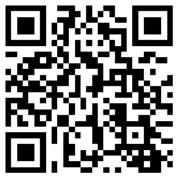

# Vue Canvas Poster 🎉

> [Vue Canvas Poster](https://sunniejs.github.io/vue-canvas-poster/#/) 一个通过 css 属性画 canvas 图片的轻量级的 vue 组件。 (A lightweight vue components use canvas draw image by css properties.)

> [Vue Canvas Poster 文档](https://sunniejs.github.io/vue-canvas-poster/#/)

#### 主要特性：

- 绘制文本(换行、超出内容省略号、中划线、下划线、文本加粗、文字缩进)
- 绘制图片(圆角、旋转、边框、模式:类似小程序 image mode)
- 绘制矩形(圆角、旋转、边框)
- 绘制二维码
- 渐变
- 阴影

#### 为什么使用 vue-canvas-poster

**简单：** 使用类`css`属性的方式生成`canvas`图。  
**易用：** 通过`npm`安装，简单上手 。  
**无依赖：** 无其他依赖库。  
**高清：** 可以通过 `widthPixels` 设置生成图片尺寸，解决图片模糊问题。

#### 升级说明

v1.2.0 文本添加缩进特性 

v1.0.0 以上增加了很多特性，新老版本不兼容，请谨慎升级，老版本不在维护，如果你用的是老版本的请移步 [0.1.16](https://github.com/sunniejs/vue-canvas-poster/tree/0.1.16)

注意：版本 v1.1.1 及以上采用 `VueCanvasPoster` 大写，低版本`vueCanvasPoster`升级需要修改

```
import { VueCanvasPoster } from 'vue-canvas-poster'
```

#### 预览

<p>
  
</p>

#### 线上 Demo

[查看 demo](https://www.sunniejs.cn/vant-demo/#/example/poster) 建议手机端查看

手机扫码查看

 <p>
  
</p>

#### 上线项目

<p>
  
</p>

#### 关注我的知乎，掘金

知乎: [vue canvas 生成微信分享海报](https://zhuanlan.zhihu.com/p/150478131)  
掘金: [vue canvas 生成微信分享海报](https://juejin.im/post/5d47e18c6fb9a06b1f1415f3)

#### 特别鸣谢 ​

[Painter](https://github.com/Kujiale-Mobile/Painter)

#### 贡献代码

使用过程中发现任何问题都可以提[Issue](https://github.com/sunniejs/vue-canvas-poster/issues) 给我，也非常欢迎 PR 或 [Pull Request ](https://github.com/sunniejs/vue-canvas-poster/pulls)

#### 如何找到失散已久的组织？

&nbsp;&nbsp;&nbsp;&nbsp;扫描下方二维码:point_down::point_down:关注“前端女塾”

 <p>
  
</p>

关注公众号：回复“加群”即可加 前端仙女群
