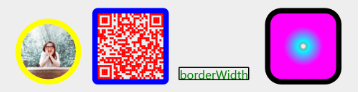

## 设置边框

你可以为文字，图片，矩形，二维码设置边框。

| 属性         | 属性   | 说明                                                           | 默认                   |
| ------------ | ------ | -------------------------------------------------------------- | ---------------------- |
| borderRadius | 边界圆角程度，如果是正方形布局，该属性为一半宽或高时，则为圆形。v1.2.0新增支持百分号设置 | 0                      |
| borderWidth  | 边界宽度，外边界                                               | 必设值，否则无边框效果 |
| borderColor  | 边框颜色                                                       | black                  |
| borderStyle  | 边框样式，支持 dashed、dotted、solid （v1.2.0新增）                          | solid                  |
#### 举例

<details><summary>例子代码（点击展开）</summary><br>

```javascript
return {
  width: '654px',
  height: '1000px',
  background: '#eee',
  views: [
    {
      type: 'image',
      url: require('./assets/avatar.png'),
      css: {
        bottom: '40px',
        left: '40px',
        borderRadius: '50px',
        borderWidth: '10px',
        borderColor: 'yellow',
        width: '100px',
        height: '100px'
      }
    },
    {
      type: 'qrcode',
      content: 'https://github.com/sunniejs/vue-canvas-poster',
      css: {
        bottom: '40px',
        left: '180px',
        color: 'red',
        borderWidth: '10px',
        borderColor: 'blue',
        width: '120px',
        height: '120px'
      }
    },
    {
      type: 'text',
      text: 'borderWidth',
      css: {
        bottom: '40px',
        right: '200px',
        color: 'green',
        borderWidth: '2px'
      }
    },
    {
      type: 'rect',
      css: {
        bottom: '40px',
        right: '40px',
        color: 'radial-gradient(rgba(0, 0, 0, 0) 5%, #0ff 15%, #f0f 60%)',
        borderRadius: '20px',
        borderWidth: '10px',
        width: '120px',
        height: '120px'
      }
    }
  ]
}
```

</details>

#### 效果


