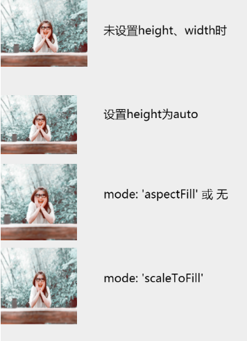

## 绘制图片 image

`image` 可以设置成本地图片或者网络图片， 本地用 `require()` 引入图片。并且如果未设置 image 的长宽，则长宽的属性值会默认设为 auto。

| CSS 属性名称 | 属性   | 说明                 | 默认值     |
| ------------ | ------ | -------------------- | ---------- |
| width        | String | image 的宽度         | auto       |
| height       | String | image 的高度         | auto       |
| mode         | String | 图片裁剪、缩放的模式 | aspectFill |

**scaleToFill**：不保持纵横比缩放图片，使图片的宽高完全拉伸至填满 image 元素

**aspectFill**：保持纵横比缩放图片，只保证图片的短边能完全显示出来。也就是说，图片通常只在水平或垂直方向是完整的，另一个方向将会发生截取。

**注：mode 属性和小程序 image 的 mode 属性功能一致，只是支持的类型只有两种，且默认值不同。 当 width 或 height 属性设置为 auto 时，mode 属性失效**

#### 举例

<details><summary>例子代码（点击展开）</summary><br>

```javascript
return {
  width: '654px',
  height: '1000px',
  background: '#eee',
  views: [
    {
      type: 'image',
      url: require('./assets/avatar.png')
    },
    {
      type: 'text',
      text: '未设置height、width时',
      css: {
        left: '270px',
        top: '60px',
        fontSize: '30px'
      }
    },
    {
      type: 'image',
      url: require('./assets/avatar.png'),
      css: {
        width: '200px',
        height: 'auto',
        top: '250px'
      }
    },
    {
      type: 'text',
      text: '设置height为auto',
      css: {
        left: '270px',
        top: '280px',
        fontSize: '30px'
      }
    },
    {
      type: 'image',
      url: require('./assets/avatar.png'),
      css: {
        width: '200px',
        height: '200px',
        top: '430px'
      }
    },
    {
      type: 'text',
      text: "mode: 'aspectFill' 或 无",
      css: {
        left: '270px',
        fontSize: '30px',
        top: '490px'
      }
    },
    {
      type: 'image',
      url: require('./assets/avatar.png'),
      css: {
        width: '200px',
        height: '200px',
        mode: 'scaleToFill',
        top: '650px'
      }
    },
    {
      type: 'text',
      text: "mode: 'scaleToFill'",
      css: {
        left: '270px',
        top: '710px',
        fontSize: '30px'
      }
    }
  ]
}
```

</details>

#### 效果


