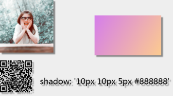

## 设置阴影 shadow

你可以为文字，图片，矩形，二维码设置阴影。  
在修饰 text 时则相当于 text-shadow  
修饰 image 和 rect 时相当于 box-shadow  
修饰 qrcode 时，则相当于二维码有效区域的投影

| 属性   | 属性   | 说明                     | 默认 |
| ------ | ------ | ------------------------ | ---- |
| shadow | String | 阴影 与 CSS 设置保持一直 |      |

```bash
shadow: 'h-shadow v-shadow blur color';
h-shadow: 必需。水平阴影的位置。允许负值。
v-shadow: 必需。垂直阴影的位置。允许负值。
blur: 必需。模糊的距离。
color: 必需。阴影的颜色。
```

#### 举例

<details><summary>例子代码（点击展开）</summary><br>

```javascript
return {
    width: '654px',
    height: '1000px',
    background: '#eee',
    views: [
        {
            type: 'image',
            url: 'https://www.sunniejs.cn/static/avatar.png',
            css: {
                width: '200px',
                height: '200px',
                shadow: '10px 10px 5px #888888'
            }
        },
        {
            type: 'rect',
            css: {
                width: '250px',
                height: '150px',
                right: '50px',
                top: '60px',
                shadow: '10px 10px 5px #888888',
                color: 'linear-gradient(120deg, #fccb90 0%, #d57eeb 100%)'
            }
        },
        {
            type: 'qrcode',
            content: 'https://github.com/sunniejs/vue-canvas-poster',
            css: {
                top: '230px',
                width: '120px',
                height: '120px',
                shadow: '10px 10px 5px #888888'
            }
        },
        {
            type: 'text',
            text: "shadow: '10px 10px 5px #888888'",
            css: {
                left: '150px',
                fontSize: '30px',
                shadow: '10px 10px 5px #888888',
                top: '290px'
            }
        }
    ]
}
```

</details>

#### 效果


